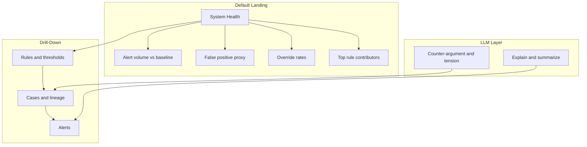

# Product Requirements Document: Mercury Internal Risk Operations Platform — v2 (Strategist Control Plane)

**Document type:** Product Requirements Document (PRD), v2  
**Audience:** Internal product, design, and engineering review  
**Status:** Draft for review  
**Last updated:** February 2025  
**Related:** [PRD-Risk-Operations-Platform.md](PRD-Risk-Operations-Platform.md) (v1 — prototype baseline)

---

## Summary

This PRD defines **v2** of the Mercury Internal Risk Operations Platform: the **strategist control plane** evolution. v2 reorients the product so that the **primary surface is system health and rule/decision performance**; alert and case work is secondary, with full **decision lineage** and a **tension-oriented LLM** that surfaces disagreement and ambiguity rather than only explaining or recommending. v2 extends and reorients v1; v1 remains the reference for the current prototype and for investigator/ops workflows.

---

## 1. Relationship to v1

- **v1** describes the existing prototype: unified alerts, cases, explainability (“why flagged”), workflow actions, self-serve views, and an LLM assistant that explains and summarizes. The default experience is triage- and alert-centric.
- **v2** shifts the center of gravity to the **Risk Strategist as system owner**. The default experience answers “How is our risk system behaving?” before “Which alerts do I work?” All v1 functional and non-functional requirements that remain in scope (unified data, explainability, similar-case search, workflow actions, auditability, RBAC, guardrails) are retained and extended by the requirements below.

---

## 2. Strategic Shift: Risk Strategist as System Owner

### 2.1 How Risk Strategists Actually Operate

A Risk Strategist at Mercury is **not primarily an investigator** and **not primarily a dashboard user**. They spend most of their time:

- **Designing decision systems** (rules, thresholds, escalation logic)
- **Reviewing outcomes and drift**, not individual alerts
- **Debugging why the system behaved the way it did**
- **Arguing tradeoffs internally** (risk vs. customer experience vs. ops cost)
- **Preparing logic that must survive partner bank scrutiny and audits**

They drop into individual accounts or cases only when:

- A pattern looks wrong
- An investigator escalates ambiguity
- A policy decision needs grounding in reality

### 2.2 Implication for the Product

The **default experience** must answer **“How is our risk system behaving?”** before **“Which alerts do I work?”** The platform must provide evidence that the strategist **owns the system**, not just the cases. This distinction is the key lens for all v2 requirements below.

---

## 3. System Health as Primary Surface

### 3.1 Default Landing

The **default landing page** (first surface after login for Risk Strategists) must answer:

**“How is our risk system behaving today?”**

### 3.2 Required Content (Functional Requirements)

The System Health surface must include:

| Element | Description |
|--------|-------------|
| **Alert volume vs baseline** | Current alert volume compared to baseline (e.g., week-over-week, by segment); ability to segment by rule, risk tier, or product area. |
| **False-positive proxy metrics** | Proxy measures for false positives where true labels are unavailable (e.g., close-as-no-issue rate by rule/segment, disposition mix over time). |
| **Investigator override rates** | Rate at which investigators override rule or system recommendations (override vs. accept), by rule and segment where feasible. |
| **Top rule contributors** | Rules ranked by alert volume and by error/override contribution (e.g., rules that drive the most “closed as no issue” or overrides). |

### 3.3 Success Criteria

- Strategist sees **system health first**; drill-down to rules, cohorts, and only then to specific alerts/cases when needed.
- The product signals “strategist tool” and “system owner,” not “ops tool” or “investigator power tool.”

---

## 4. Decision Lineage Everywhere

### 4.1 Requirement

Every **alert**, **case**, and **recommendation** must expose:

- **Which rules fired** (and rule version/ID)
- **Which thresholds applied**
- **Which policy version was active**
- **Who last modified the logic** (where applicable)

This is critical for partner bank trust, internal blame-free debugging, and regulatory defensibility.

### 4.2 Case View: Beyond “Here Is the Evidence”

Case views must extend beyond a self-contained “here is all the relevant information; decide” presentation. They must include:

- **Decision lineage:** e.g., “This account passed because Rule X was disabled on DATE”; “This override was added during backlog surge.”
- **Explicit uncertainty markers:** e.g., “Signal confidence: low”; “Data incomplete: missing counterparty enrichment.”

Strategists must be able to ask: “Why did we previously allow this?” “Is this still aligned with current policy?” “Is the system being internally inconsistent?”

---

## 5. LLM as Counter-Argument and Tension Engine

### 5.1 Reframe

The LLM must be explicitly designed to **surface disagreement**, **edge cases**, and **where policy may be outdated** — not only to explain or recommend. Risk strategists distrust clean answers; they value surfacing tension.

### 5.2 Example Interactions

In addition to v1 behaviors (explain why flagged, summarize, similar cases, draft escalation), the product must support:

| User ask | Expected behavior |
|----------|-------------------|
| “Give me the strongest argument **against** blocking this account.” | LLM surfaces the best counter-argument and competing interpretation, not only the case for blocking. |
| “Where does this case conflict with our stated policy?” | LLM highlights tensions between case facts and current policy. |
| “What would a regulator or partner bank challenge here?” | LLM identifies likely challenges and gaps in documentation or logic. |

### 5.3 Product and Prompt Design Requirement

Product and prompt design must **favor surfacing competing interpretations and ambiguity**, not smoothing over conflict. Example: instead of “This account was flagged due to unusual wire activity,” the system should support responses like “This behavior violates Rule A, but resembles 42 previously approved cases in segment X. The main uncertainty is Y.”

---

## 6. Self-Serve: Sandbox vs. Operational

### 6.1 Two Modes

Self-serve tools and dashboards (v1 Section 11) are split into two modes to satisfy internal power boundaries and compliance:

| Mode | Purpose | Characteristics |
|------|---------|------------------|
| **Sandbox (exploratory)** | Ad-hoc exploration, hypothesis testing | Private; time-boxed (e.g., session or 24h); not used for audit or ops decisions; clearly labeled “exploratory”; not shareable as operational artifact; no expectation of reproducibility for compliance. |
| **Operational** | Recurring reviews, handoffs, exam-ready views | Requires justification (e.g., purpose, scope); versioned; logged; shareable with investigators/ops; usable for partner/exam handoffs with existing sanitization rules. |

### 6.2 Blast-Radius and Compliance

- **Explicit controls:** e.g., “This view cannot be shared”; “This query touches regulated PII fields.”
- **Distinction** between exploratory and operational so that compliance and partner banks can approve operational use without blocking exploration.
- Same RBAC and allowlist principles as v1; Sandbox views cannot be promoted to Operational without justification and audit trail.

---

## 7. Explicit Tradeoffs in the UI

### 7.1 Requirement

When a strategist **changes rules, thresholds, or policy** (or when the system proposes such a change), the UI must surface **second-order effects** where feasible, for example:

- “This will increase false positives by approximately X%.”
- “This will slow onboarding for segment Y.”
- “This change affects Z active customers.”

### 7.2 Rationale

Risk strategy is fundamentally about **owning tradeoffs**. These must be explicit in the product, not implicit.

---

## 8. What Stays from v1

The following remain in scope and are not replaced by v2:

- **Unified data and views:** Alerts, accounts, transactions, risk signals/scores, rules/policies, case history and outcomes; navigation from alert → account → transactions → cases and back.
- **Explainability:** “Why was this account/alert flagged?” — narrative and structured breakdown with links to evidence.
- **Similar-case search:** “What similar cases exist and how were they resolved?”
- **Workflow actions:** Assign, escalate, close, request info; document decision with structured rationale; all auditable.
- **Auditability, RBAC, guardrails:** Immutable audit log; no LLM-only decisions on account status or SAR; deterministic systems own state; same RBAC for main app and generated views.
- **Self-serve views and dashboards:** Retained but governed by the new **Sandbox vs. Operational** split and blast-radius controls (Section 6).

---

## 9. Out of Scope or Deferred in v2

- **Mercury external API contracts and identity provider:** Still TBD; no change in v2.
- **Implementation details** for System Health metrics (e.g., how to compute “false positive proxy” or “override rate” without labels): left to Technical Design v2 or implementation stories.

---

## 10. Open Questions and Success Metrics

### 10.1 Open Questions

| Item | Notes |
|------|--------|
| How to compute false-positive proxy without ground-truth labels | May require disposition-based proxies or sampling; TBD with ops and compliance. |
| How to time-box Sandbox views | Session-only vs. 24h retention; effect on “save for later” behavior. |
| Exact semantics for “affects Z active customers” | Which segments, what time window, and what “affects” means (e.g., new holds, slower path). |

### 10.2 Success Metrics (v2 Additions / Refocus)

| Category | Example metrics |
|----------|------------------|
| **Strategist adoption** | % of strategist sessions that touch System Health as first touch; time spent on system health vs. alert list. |
| **Counter-argument use** | Use of counter-argument and tension-oriented prompts (e.g., “strongest argument against,” “what would regulator challenge”). |
| **Operational views** | % of operational (non-Sandbox) views that pass compliance review when submitted. |
| **Lineage and drift** | Reduction in “why did the system do X?” escalations; audit/exam findings related to missing lineage (target: none). |

---

## 11. Strategist Control Plane: High-Level Flow

---

*End of PRD v2.*
