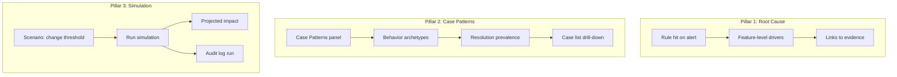

# Product Requirements Document: Mercury Internal Risk Operations Platform — v3 (Signal Explainability, Case Patterns, Scenario Simulation)

**Document type:** Product Requirements Document (PRD), v3  
**Audience:** Internal product, design, and engineering review  
**Status:** Draft for review  
**Last updated:** February 2025  
**Related:** [PRD-Risk-Operations-Platform.md](PRD-Risk-Operations-Platform.md) (v1 — baseline), [PRD-Risk-Operations-Platform-v2.md](PRD-Risk-Operations-Platform-v2.md) (v2 — strategist control plane)

---

## Summary

This PRD defines **v3** of the Mercury Internal Risk Operations Platform. v3 adds three capability pillars that close gaps between the current prototype and operational/regulatory reality: **(1) Signal explainability and root cause analytics** — drill-down from rule hits to feature-level drivers and behavioral patterns so strategists can justify decisions to partners and regulators; **(2) Case comparison and pattern discovery** — a Case Patterns surface that groups cases by behavior archetype and shows resolution prevalence per pattern; **(3) Decision impact forecasting** — scenario simulation tied to rules so strategists can quantify the operational impact of tuning (e.g. alert volume, false-positive proxy, missed high-risk events) before committing changes. v3 extends v1 and v2; all v1/v2 requirements remain in force unless explicitly extended below. No new LLM decision authority; simulation and pattern views are analytical only.

---

## 1. Relationship to v1 and v2

- **v1** defines the baseline: unified alerts, cases, explainability (“why flagged”), workflow actions, self-serve views, and an LLM assistant. **v2** reorients the default experience to System Health, decision lineage, counter-argument LLM, Sandbox vs. Operational self-serve, and explicit tradeoffs in the UI.
- **v3** builds on both. It does **not** replace or re-implement v1/v2 features. It extends:
  - **Explainability** (v1 Sections 6.2, 7.4; v2 drill-down): from “which rules fired” to “why they fired” in terms of actual data patterns and feature drivers.
  - **Policy and tuning** (v1 Section 5.4; v2 Section 7): from static tradeoff text to **user-driven scenario simulation** before committing rule/threshold changes.
  - **Case and similar-case** (v1 Section 6.3): from list + similar-case search to **pattern-level** insight — behavior archetypes and resolution prevalence.

LLM boundaries, RBAC, and audit model are unchanged except where a new feature requires it (e.g. logging simulation runs).

---

## 2. Pillar 1: Signal Explainability & Root Cause Analytics

### 2.1 Goal

Move from “which rules fired and override rates” to **why** those rules fired in terms of actual data patterns — so strategists can explain to partners and regulators with concrete, verifiable evidence.

### 2.2 Functional Requirements

| Requirement | Description |
|-------------|-------------|
| **Drill-down from rule hit to feature drivers** | For any alert (and where applicable, case), support drill-down from a rule hit to the underlying *feature-level* contributions. Examples (placeholders until Mercury schemas exist): velocity vs. threshold, country risk tier, counterparty risk score, transaction count/size bands, product usage flags. |
| **Behavioral pattern breakdown** | Where the rule or risk model uses behavioral signals (e.g. velocity, recurrence, timing), show a short breakdown (e.g. “Wire count 7-day: 12 vs threshold 5”; “Top counterparty risk tier: 3”). No raw PII in summaries unless RBAC allows. |
| **Traceability to evidence** | Each driver or pattern line links to supporting evidence (e.g. transaction list, account attributes, rule definition and threshold) so reviewers can verify. |

### 2.3 Success Criteria

- A strategist can answer “Why did rule X fire on this alert?” with concrete data points (thresholds, tiers, scores) and follow links to evidence.
- The same story holds for partner bank or exam: justification is data-level, not only rule-name-level.

### 2.4 Out of Scope for v3

- Changing how rules or risk scores are *computed*. v3 is about *exposing* existing signals in an explainability layer. Implementation depends on rule/score systems exposing contribution breakdown (see Open Questions).

---

## 3. Pillar 2: Case Comparison and Pattern Discovery

### 3.1 Goal

Move from “list of cases” and “similar-case search” to **pattern-level** insight: how cases cluster by behavior/segment and how each pattern resolves, so strategists can tune systems by behavior archetype.

### 3.2 Functional Requirements

| Requirement | Description |
|-------------|-------------|
| **Case Patterns panel (or equivalent)** | A dedicated surface that groups cases by **behavior archetype** (e.g. “High velocity intl wires,” “Structuring-like,” “High-risk jurisdiction exposure”). Archetypes can be rule-based, segment-based, or derived from disposition tags; exact taxonomy TBD with product/compliance. |
| **Resolution prevalence per pattern** | For each pattern/archetype, show resolution mix (e.g. % closed no action, % escalated, % SAR) and, where useful, trend over time or by segment. |
| **Navigation** | From a pattern, drill to the underlying case list (with same RBAC and audit as Cases). From a case, optionally “see pattern” to land on the pattern view. |

### 3.3 Success Criteria

- Strategists can see “which behavior clusters we have” and “how we typically resolve them,” and use that to tune rules and thresholds by pattern, not only by individual case review.

### 3.4 Out of Scope for v3

- Full ML clustering (if desired, can be a later iteration). v3 can start with rule/segment/outcome-based grouping and a small set of defined archetypes.

---

## 4. Pillar 3: Decision Impact Forecasting (Scenario Simulation)

### 4.1 Goal

Move from static tradeoff estimates (v2 Section 7) to **user-driven scenario simulation**: “If I change this threshold (or rule parameter), what is the projected impact?” before committing.

### 4.2 Functional Requirements

| Requirement | Description |
|-------------|-------------|
| **Scenario simulation tied to rules** | For selected rules (or a rule group), allow the strategist to run a **simulation**: change a threshold or parameter (e.g. velocity cap, amount threshold) and see **projected** impact over a defined window (e.g. last 90 days). |
| **Impact metrics (where feasible)** | Projected change in alert volume; proxy false-positive rate (e.g. close-as-no-action); and—if data allows—estimated change in “missed” high-risk events (e.g. large single transactions that would no longer alert). Trade-offs between risk coverage and customer/ops impact must be explicit. |
| **No automatic application** | Simulation is **what-if only**. Applying the change remains a separate, audited action (e.g. in rule config or policy workflow). Simulation runs are logged (who, when, rule, scenario, result digest) for audit and reproducibility. |

### 4.3 Success Criteria

- A strategist can state: “If I raise this threshold by X, false positives drop by ~Y% but we’d miss approximately Z large single-transaction alerts in the last 90 days,” and use that to justify or reject a change before committing.

### 4.4 Out of Scope for v3

- Full causal modeling or multi-rule optimization. v3 focuses on single-rule (or small set) scenario simulation with clearly documented assumptions and data limitations.

---

## 5. What v3 Does Not Do

- Does not replace or re-implement v1/v2 features.
- Does not introduce new LLM decision authority (simulation and pattern views are analytical; humans still decide rule changes and case outcomes).
- Does not define Mercury’s internal rule or risk-score APIs; v3 calls out dependencies and leaves contracts to Technical Design v3 or implementation.

---

## 6. Success Metrics (v3 Additions)

| Category | Example metrics |
|----------|-----------------|
| **Explainability** | Use of feature-level drill-down from rule hits; reduction in “why did this rule fire?” escalations to engineering or policy. |
| **Pattern discovery** | Use of Case Patterns panel (sessions, drill-through to cases); strategist feedback on usefulness for tuning by archetype. |
| **Simulation** | Number of scenario runs per rule/period; use of simulation results in change requests or policy documentation; audit trail of simulation runs for exam. |

---

## 7. Open Questions

| Item | Notes |
|------|------|
| **Feature-level drivers** | Pillar 1 requires rule/score system to expose contribution breakdown (e.g. rule output payload or risk-score API shape). Contract and schema TBD with engineering and Mercury internal systems. |
| **Behavior archetype taxonomy** | Pillar 2: exact set of archetypes (rule-based, segment-based, disposition-derived) to be defined with product and compliance. |
| **Simulation time window** | Default window (e.g. last 90 days) and configurability TBD. |
| **Estimating “missed” alerts** | How to estimate alerts that would no longer fire under a hypothetical threshold (e.g. replay over historical data with hypothetical params); assumptions and limitations must be documented. |

---

## 8. High-Level Flow (v3 Additions)

---

*End of PRD v3.*
