# Product Requirements Document: Mercury Internal Risk Operations Platform — v4 (Operational Scale & Exam Readiness)

**Document type:** Product Requirements Document (PRD), v4  
**Audience:** Internal product, design, and engineering review; useful for compliance and partner-facing discussions  
**Status:** Draft for review  
**Last updated:** February 2025  
**Related:** [PRD-Risk-Operations-Platform.md](PRD-Risk-Operations-Platform.md) (v1 — baseline), [PRD-Risk-Operations-Platform-v2.md](PRD-Risk-Operations-Platform-v2.md) (v2 — strategist control plane), [PRD-Risk-Operations-Platform-v3.md](PRD-Risk-Operations-Platform-v3.md) (v3 — signal explainability, case patterns, simulation). **Source:** Gaps derived from internal deep-research ([deep-research-report.md](../deep-research-report.md)) grounded in Mercury public materials and prototype comparison.

---

## Summary

This PRD defines **v4** of the Mercury Internal Risk Operations Platform: **Operational Scale & Exam Readiness** (also referred to as “Production & External Readiness”). v4 closes seven prioritized gaps identified in the deep-research report by specifying requirements for: **(1)** rule and model governance lifecycle; **(2)** case management at QC and BPO scale; **(3)** queueing, SLAs, and escalation routing; **(4)** evidence packages and partner-bank-safe exports; **(5)** RBAC, purpose limitation, and audit depth; **(6)** explainability that is reviewable and contestable; **(7)** customer-impact workflow (appeals, remediation, constrained communications). v4 extends v1, v2, and v3; it does **not** remove or replace their requirements. No new LLM decision authority is introduced; humans and deterministic systems remain responsible for final decisions.

---

## 1. Relationship to v1, v2, and v3

- **v1** defines the baseline: unified alerts, cases, explainability, workflow actions, self-serve views, and an LLM assistant. **v2** adds System Health as default, decision lineage, counter-argument LLM, Sandbox vs. Operational self-serve, and explicit tradeoffs. **v3** adds signal explainability, Case Patterns, and scenario simulation.
- **v4** addresses gaps derived from internal deep-research (Mercury public materials, job postings, legal/compliance disclosures, and prototype comparison). The seven gap areas are:
  1. Rule and model governance lifecycle (draft → approval → rollout → rollback)
  2. Case management for QC and BPO scale (evidence checklists, scorecards, calibration)
  3. Queueing, SLAs, and escalation routing as first-class primitives
  4. Evidence packages and partner-bank-safe exports
  5. RBAC, purpose limitation, and immutable audit (retention, legal-hold)
  6. Explainability that is reviewable and contestable (evidence binding, counterfactual)
  7. Customer-impact workflow (appeals, remediation, constrained comms)

All v1–v3 requirements remain in force. v4 adds or extends requirements only in the areas above.

---

## 2. Rule and Model Governance Lifecycle (Gap 1)

### 2.1 Goal

Support production-grade governance of rules and risk models so that changes are documented, approved, staged, and reversible—meeting Mercury’s documented need to maintain “scenarios, thresholds, segments, tuning and any changes … over time” and regulator expectations for monitoring-system methodology.

### 2.2 Functional Requirements

| Requirement | Description |
|-------------|-------------|
| **Policy lifecycle** | Support a defined lifecycle for rule and model changes: **draft** → **review** → **approval** (with sign-offs) → **staged deployment** (e.g. shadow or limited traffic) → **full rollout** → **rollback** when needed. Transitions are auditable (who, when, from/to state). |
| **Immutable version artifacts** | Each version of a rule or model config is stored as an immutable artifact linking: rule/config, model version, feature schema, and (where applicable) decision outputs. Version ID is referenced in alerts and cases for lineage. |
| **Replay and lineage** | Decisioning inputs and outputs are stored (event-sourced or equivalent) so that investigations can reproduce “what the system knew when it decided” and support replay for backtesting or counterfactual analysis. Effective-date and feature-flag mappings support investigations (e.g. “rule X was disabled on date Y”). |
| **Rollback** | Ability to roll back a rule or config to a prior version with approval and audit; rollback is a first-class transition in the lifecycle. |

### 2.3 Success Criteria

- A strategist or compliance reviewer can see the full lifecycle of a rule (draft → approved → deployed → rolled back) and which version was effective for any given alert or case.
- Regulators or partner banks can be shown reproducible decision lineage tied to specific rule/model versions.

### 2.4 Open Questions

- **Ownership:** Risk strategy vs. compliance vs. engineering for approval and deployment steps (to be defined with product and compliance).
- **Tooling:** Whether policy lifecycle lives in a separate policy repo or is platform-native (Technical Design to specify).

---

## 3. Case Management: QC and BPO Scale (Gap 2)

### 3.1 Goal

Elevate “case” to a system of record that supports quality control (QC), defect logging, calibration across internal and BPO investigators, and multi-author workflows—aligning with Mercury’s publicly documented QC programs for account fraud and ongoing due diligence.

### 3.2 Functional Requirements

| Requirement | Description |
|-------------|-------------|
| **Structured evidence checklist** | For each case (and by alert type: e.g. KYB/ODD, account fraud, TM/sanctions), support a **structured evidence checklist** so investigators and QC know what evidence is required and what has been collected. Checklist is configurable by alert type; completion is auditable. |
| **QC module** | Support a **QC workflow**: scorecards per case (or sample), **defect taxonomy** (e.g. documentation gap, logic error, policy deviation), sampling plans, and **calibration sessions** (e.g. inter-rater alignment). QC results feed investigator and vendor (BPO) performance views. |
| **Investigator and vendor performance** | Dashboards or views (role-appropriate) showing performance metrics by investigator and by vendor/BPO: e.g. volume, defect rates, disposition mix, calibration scores. Used for training, capacity, and vendor management. |
| **Multi-author workflows** | Cases support multiple authors/roles: investigator, QC reviewer, compliance reviewer. **Locked sections** (e.g. QC verdict) and full **audit trail** so that who added or changed what is clear. No silent overwrites. |

### 3.3 Success Criteria

- QC reviewers can score cases against a defect taxonomy, run sampling plans, and see calibration and performance trends.
- BPO and internal investigators are measured consistently; defects and trends are visible for operational and exam readiness.

### 3.4 Out of Scope for v4

- Full BPO vendor system integration (e.g. pushing cases to vendor tools). v4 specifies platform capabilities and data model; integration with external BPO systems is TBD.

---

## 4. Queueing, SLAs, and Escalation Routing (Gap 3)

### 4.1 Goal

Make **queues**, **SLA clocks**, and **escalation paths** first-class primitives so that triage, first action, and closure are measurable and time-bounded—supporting SAR timing expectations (e.g. FinCEN 30-day, up to 60-day) and partner-bank exam readiness.

### 4.2 Functional Requirements

| Requirement | Description |
|-------------|-------------|
| **Multi-queue triage** | Support **queues** for alerts/cases that can be filtered and routed by: product/rail, severity, customer segment, due date, and (where applicable) assignment. Assignment logic (e.g. round-robin, skill-based, or manual) is configurable within policy. |
| **SLA clocks** | Track **SLA clocks** for: time to triage, time to first action, time to closure. Breach detection (e.g. approaching or past due) with alerts and reporting. SLA targets are configurable by queue or alert type (e.g. SAR-relevant vs. standard). |
| **Escalation paths** | **Explicit escalation paths**: to compliance, partner bank, legal, and customer support. **Templated handoffs** (e.g. required fields, checklist, and package format) so that escalation is consistent and auditable. Routing rules (e.g. “all SAR referrals go to compliance”) are configurable. |

### 4.3 Success Criteria

- Ops and strategists see queue depth, SLA adherence, and breach counts; escalations follow defined paths with full audit.
- SAR-relevant workflows can be measured against 30/60-day expectations where applicable.

### 4.4 Reference

- SAR timing: FinCEN guidance (30-day filing expectation from initial detection, with limited extension; not exceeding 60 days to identify suspect) should inform SLA design for SAR-related queues where Mercury policy adopts it.

---

## 5. Evidence Packages and Partner-Bank-Safe Exports (Gap 4)

### 5.1 Goal

Enable one-click (or near) generation of **redacted case packets** for partner banks, regulators, and exams—with configurable redaction, field-level entitlements, and full audit of who exported what and why.

### 5.2 Functional Requirements

| Requirement | Description |
|-------------|-------------|
| **Export bundles** | Support **export bundles** (case packets) that include: timeline, rationale, rules/models that fired (and versions), and supporting documents. Content is **redacted** according to configurable policy (e.g. partner-bank-safe: minimal PII; exam: regulator-appropriate). |
| **Redaction and entitlements** | **Configurable redaction policies** and **field-level entitlements** so that exports can be tailored to recipient (e.g. partner bank vs. internal exam prep). No ad-hoc bulk PII export by default; exports are purpose-scoped. |
| **Export templating** | **Deterministic rendering** (templates or structured format) so that the same case produces the same export for the same policy. Export engine logs: **who** exported **what**, **when**, and **for what purpose** (e.g. “partner bank handoff,” “exam response”). |

### 5.3 Success Criteria

- A strategist or compliance user can generate a partner-bank-safe or exam-ready packet from a case in one action; the packet is reproducible and its generation is audited.

### 5.4 Out of Scope for v4

- Real-time API push to partner bank systems (export may be file or link; integration TBD).

---

## 6. RBAC, Purpose Limitation, and Audit Depth (Gap 5)

### 6.1 Goal

Extend v1 RBAC and audit with **need-to-know** scopes, **purpose-based access**, and **audit store** capabilities (retention, legal-hold, search) so that access and usage are defensible for exams and legal requests.

### 6.2 Functional Requirements

| Requirement | Description |
|-------------|-------------|
| **Need-to-know RBAC** | **Role-based access** with **need-to-know** scopes: e.g. fraud investigator vs. ODD vs. compliance vs. support. Permissions align with job function; PII and sensitive actions (e.g. export, escalate) are gated by role. Same model for main app and generated views (per v1). |
| **Purpose-based access** | Support **purpose-based access tagging** where required by policy: e.g. “investigation,” “QA,” “exam response.” Access to certain data or export actions may require a stated purpose; purpose is logged with the access event. |
| **Append-only audit store** | **Append-only audit store**: no updates or deletes. **Search** and **retention rules** (e.g. retain for 5+ years per compliance). **Legal-hold controls**: ability to preserve and query audit data under legal hold for exams or legal process. |
| **Audit queries** | Authorized users (e.g. compliance, security) can run **audit queries** for exams and legal requests (e.g. “all access to case X,” “all exports in date range,” “all workflow actions by user Y”). Results are themselves access-controlled and auditable. |

### 6.3 Success Criteria

- Every sensitive read, workflow action, export, and LLM use is in the audit store with retention and optional legal hold; exam and legal queries are supported without ad-hoc extraction.

### 6.4 Alignment with v1

- v1 Sections 7.3–7.5 (Auditability, Explainability, Security and Access) remain in force. v4 extends with purpose, retention, and legal-hold.

---

## 7. Explainability: Reviewable and Contestable (Gap 6)

### 7.1 Goal

Ensure explainability is **reviewable** (bound to raw evidence) and **contestable** (counterfactual tooling with replayable data) so that strategists and regulators can verify and challenge “why” a decision was made.

### 7.2 Functional Requirements

| Requirement | Description |
|-------------|-------------|
| **Explainability panels bound to evidence** | **Explainability panels** bind each rule/model hit to **raw evidence** (e.g. transactions, entity resolution, screening matches). Where the upstream system provides it, include **confidence** and **uncertainty** (e.g. “Signal confidence: low,” “Data incomplete”). Links from each driver to evidence are explicit (extends v3 Pillar 1). |
| **Counterfactual tooling** | Support **counterfactual tooling**: “If this threshold (or parameter) changed, which customers/alerts would move?” Use **replayable data** (e.g. historical alerts re-evaluated with hypothetical params), not estimates only. Integrates with v3 scenario simulation and v2 lineage; results are analytical only—no automatic application of changes. |
| **No new LLM decision authority** | LLM continues to explain and suggest; **human remains final decider**. Counterfactual and explainability outputs do not trigger account or case actions without human approval. |

### 7.3 Success Criteria

- A reviewer can follow every rule hit to underlying evidence and run “what if” scenarios with reproducible, replay-based results.

---

## 8. Customer-Impact Workflow (Gap 7)

### 8.1 Goal

Support **customer-facing** and **remediation** workflows where Mercury’s policies limit what can be communicated to the customer: internal rationale and regulator-ready record must be maintained even when customer messaging is constrained.

### 8.2 Functional Requirements

| Requirement | Description |
|-------------|-------------|
| **Customer-communication artifacts** | Support **customer-communication artifacts**: templates, required disclosures, and **response-by dates** (e.g. “customer must respond by date X”). Track what was sent, when, and what template was used; store against the case for audit. |
| **Appeals pipeline** | Support an **appeals pipeline** with **separation of duties**: e.g. support intake (receives appeal) vs. risk adjudication (decides). Status and outcome are tracked; full audit trail for who received, who decided, and when. |
| **Remediation tracking** | **Remediation tracking**: documents/sources **requested** and **received**; **steps completed** (e.g. KYC refresh, document upload); **re-review triggers** when remediation is complete so the case can return to the right queue. |
| **Constrained comms** | Internal **rationale** and **regulator-ready record** are always maintained in the case; customer-facing messaging may be limited by legal/compliance policy. Tool supports both: full internal narrative and optional customer-facing snippet/template. |

### 8.3 Success Criteria

- Appeals and remediation are tracked in the platform with clear ownership and audit; internal and external communication artifacts are distinguishable and retained for exam.

---

## 9. Success Metrics (v4 Additions)

| Category | Example metrics |
|----------|-----------------|
| **Governance** | Rule/model change cycle time (draft → deployed); rollback rate; % of alerts/cases with correct version lineage. |
| **Operations** | SLA adherence (triage, first action, closure); queue depth and breach counts; escalation volume by path. |
| **QC and quality** | QC coverage (e.g. % of cases scored); defect rate by taxonomy; calibration score trends; investigator/vendor performance. |
| **Exports and audit** | Export volume by purpose (partner bank, exam, legal); time-to-export for exam requests; audit query usage. |
| **Customer-impact** | Appeals received and resolution time; remediation completion rate; re-review cycle time. |

---

## 10. Risks and Mitigations

| Risk | Mitigation |
|------|------------|
| **Scope creep vs. v1–v3 delivery** | v4 is additive; prioritize by gap or epic (e.g. queue/SLA + audit first; QC and customer-impact in later phases). |
| **Dependency on Mercury identity, RBAC, and audit backend** | Technical Design and implementation to call out dependencies; open questions table to track ownership (security, compliance, engineering). |

---

## 11. What v4 Does Not Do

- Does **not** replace or re-implement v1, v2, or v3.
- Does **not** introduce new LLM decision authority (same boundary: LLM explains/suggests; humans and deterministic systems decide).
- Does **not** define Mercury’s internal rule/score/queue APIs in full; v4 specifies platform requirements and calls out dependencies for Technical Design and implementation.

---

## 12. Open Questions and Assumptions

| Item | Type | Notes |
|------|------|-------|
| Data schemas for evidence checklists and QC | Mercury-specific | Evidence checklist shape and QC defect taxonomy TBD with product and compliance. |
| Partner-bank export formats | Mercury-specific | Exact format (PDF, structured JSON, etc.) and partner acceptance TBD. |
| Identity and role model | Mercury-specific | Need-to-know roles (fraud vs ODD vs compliance vs support) to be defined with security and product. |
| Retention and legal-hold policy | Regulatory | Confirm retention period and legal-hold process with compliance. |
| SAR timing interpretation | Regulatory | How Mercury applies 30/60-day guidance to SLA targets TBD with compliance. |
| Policy lifecycle ownership | Process | Risk strategy vs. compliance vs. engineering for approval and deployment to be defined. |

---

## 13. High-Level Flow (v4 Additions)

```mermaid
flowchart TB
  subgraph governance [Gap 1: Governance]
    Draft[Draft]
    Approve[Review and approve]
    Deploy[Staged deploy and rollout]
    Rollback[Rollback]
    Draft --> Approve
    Approve --> Deploy
    Deploy --> Rollback
    Rollback --> Deploy
  end
  subgraph caseqc [Gap 2: Case and QC]
    Evidence[Evidence checklist]
    QC[QC scorecards and defects]
    Perf[Investigator and vendor performance]
    Evidence --> QC
    QC --> Perf
  end
  subgraph queue [Gap 3: Queue and SLA]
    Queue[Multi-queue triage]
    SLA[SLA clocks and breach]
    Escalate[Escalation paths]
    Queue --> SLA
    SLA --> Escalate
  end
  subgraph export [Gap 4: Exports]
    Packet[Case packet]
    Redact[Redaction policy]
    LogExport[Export audit]
    Packet --> Redact
    Redact --> LogExport
  end
  subgraph audit [Gap 5: Audit depth]
    RBAC[Need-to-know RBAC]
    Purpose[Purpose-based access]
    Store[Append-only store and legal hold]
    RBAC --> Purpose
    Purpose --> Store
  end
  subgraph explain [Gap 6: Explainability]
    Panels[Panels bound to evidence]
    Counter[Counterfactual tooling]
    Panels --> Counter
  end
  subgraph customer [Gap 7: Customer-impact]
    Comms[Customer comms and templates]
    Appeals[Appeals pipeline]
    Remed[Remediation tracking]
    Comms --> Appeals
    Appeals --> Remed
  end
```

---

*End of PRD v4.*
