# Product Requirements Document: Mercury Internal Risk Operations Platform — v5 (Remaining UX & Workflow Closure)

**Document type:** Product Requirements Document (PRD), v5  
**Audience:** Internal product, design, and engineering review; useful for compliance and partner-facing discussions  
**Status:** Draft for review  
**Last updated:** February 2025  
**Related:** [PRD-Risk-Operations-Platform.md](PRD-Risk-Operations-Platform.md) (v1 — baseline), [PRD-Risk-Operations-Platform-v2.md](PRD-Risk-Operations-Platform-v2.md) (v2), [PRD-Risk-Operations-Platform-v3.md](PRD-Risk-Operations-Platform-v3.md) (v3), [PRD-Risk-Operations-Platform-v4.md](PRD-Risk-Operations-Platform-v4.md) (v4 — Operational Scale & Exam Readiness), [Technical Design](Technical-Design-Risk-Operations-Platform.md). **Source:** Remaining gaps identified after v4 implementation, traceable to [deep-research-report.md](../deep-research-report.md) prototype coverage table and prioritized product gaps.

---

## Summary

This PRD defines **v5** of the Mercury Internal Risk Operations Platform: **Remaining UX & Workflow Closure**. v5 closes six remaining product/UX gaps (plus one optional) from the deep-research report that were not fully specified or implemented in v4: **(1)** case attachments (evidence collection); **(2)** assign to queue / route to queue from alert; **(3)** escalation path and templated handoff; **(4)** legal-hold visibility and filtering in audit; **(5)** rule lifecycle states (staged, pending approval) in the UI; **(6)** assistant citation-to-evidence; **(7)** optional recall proxy and fraud loss / chargeback report stubs. v5 extends v1–v4; it does **not** remove or replace their requirements. No new LLM decision authority is introduced.

---

## 1. Relationship to v1, v2, v3, and v4

- **v1–v3** define the baseline, strategist control plane, and signal explainability (see v4 document for summary). **v4** closes seven prioritized gaps from the deep-research report: governance lifecycle, case/QC, queue/SLA, exports, audit depth, explainability contestability, and customer-impact workflows.
- **v5** addresses the **remaining front-end/UX gaps** identified after v4: evidence attachments on cases, queue assignment from alerts, escalation path and handoff checklist, legal-hold in the audit UI, rule lifecycle states (staged/pending approval), assistant citations, and (optionally) recall/fraud-loss report stubs. These are additive UX and workflow features to reach parity with the report’s “required” capabilities in the UI.

All v1–v4 requirements remain in force. v5 adds or extends requirements only in the areas above.

---

## 2. Case Attachments (Evidence Collection)

### 2.1 Goal

Make the case a full system of record for evidence by supporting **document/evidence attachments** in addition to the structured evidence checklist (v4). Aligns with the deep-research report: “Evidence collection, attachments, structured narratives.”

### 2.2 Functional Requirements

| Requirement | Description |
|-------------|-------------|
| **Attachments list on case** | Each case supports an **attachments** list showing: document name, type (or category), date added, and uploader (or link owner). List is visible on the case detail view. |
| **Add attachment** | Users with appropriate permissions can **add an attachment** (upload file or link to document) from the case detail. Action is auditable (who, when, what). |
| **Export bundle inclusion** | When generating a case packet (v4 export), attachments can be **included or referenced** according to configurable policy (e.g. partner-bank-safe: include summary only; exam: include specific document types). |
| **Audit of add/view** | Adding, viewing, and exporting attachments are recorded in the audit log with case ID and purpose where applicable. |

### 2.3 Success Criteria

- An investigator can attach and view evidence documents (or links) on a case; exports can reference or include them per policy.
- Audit supports “who added/viewed/exported what” for attachments.

### 2.4 Out of Scope for v5

- Full document storage backend and retention policy (platform specifies capability; implementation TBD with engineering and compliance).

---

## 3. Assign to Queue / Route to Queue

### 3.1 Goal

Support **assigning or routing an alert to a queue** (not only to a user), matching the deep-research report’s “multi-queue routing” and “investigator assignment logic” so that triage and workload distribution are queue-aware.

### 3.2 Functional Requirements

| Requirement | Description |
|-------------|-------------|
| **Assign to queue from alert** | From the alert (detail or list), the user can **assign to queue** or **route to queue** via a queue selector (e.g. SAR referral, Onboarding hold, Standard triage). The selected queue is applied to the alert. |
| **Auditable assignment** | Queue assignment (and any routing reason) is recorded in the audit log (who, when, from/to queue). |
| **Queue and SLA reflect assignment** | After assignment, the alert’s displayed **queue** and **SLA** (v4) reflect the new queue so that ops see correct queue depth and SLA state. |

### 3.3 Success Criteria

- Ops can assign an alert to a queue and see queue and SLA update in the UI; assignment is auditable.

### 3.4 Alignment with v4

- v4 Section 4 (Queueing, SLAs, Escalation) defines multi-queue triage and SLA clocks. v5 adds the explicit **assign to queue** action from the alert UI.

---

## 4. Escalation Path and Templated Handoff

### 4.1 Goal

Make escalation target an **explicit path** (partner bank, compliance, legal, customer support) and require a **templated handoff** (checklist) so that escalations are consistent and auditable, per the deep-research report: “Explicit escalation paths” and “templated handoffs (required fields, checklist).”

### 4.2 Functional Requirements

| Requirement | Description |
|-------------|-------------|
| **Escalate-to selector** | The escalate modal (alert and/or case) includes an **“Escalate to”** selector with defined paths: e.g. **Partner bank**, **Compliance**, **Legal**, **Customer support**. User must select a path when escalating. |
| **Handoff checklist** | A **handoff checklist** is presented (e.g. “Case summary attached,” “Rationale documented”). Checklist items may be **configurable by path** (e.g. partner bank requires different items than internal compliance). User completes or acknowledges checklist before confirming escalation. |
| **Path and checklist in audit** | The selected **path** and **checklist state** (e.g. completed items) are recorded in the audit log with the escalation event. |

### 4.3 Success Criteria

- User selects an escalation path and completes the handoff checklist when escalating; audit shows path and checklist state.

### 4.4 Alignment with v4

- v4 Section 4 specifies “templated handoffs” and “explicit escalation paths.” v5 specifies the UI: path selector and checklist in the escalate flow.

---

## 5. Legal-Hold in Audit

### 5.1 Goal

Support **legal-hold** visibility and filtering in the audit UI so that compliance and legal can identify and query audit data under legal hold for exams and legal requests, per the deep-research report: “Legal-hold controls.”

### 5.2 Functional Requirements

| Requirement | Description |
|-------------|-------------|
| **Under legal hold** | Audit entries (or ranges) can be **tagged or marked** as “under legal hold” where policy or process requires it. (Backend and tagging process TBD; v5 specifies UI treatment.) |
| **Legal-hold filter** | The audit view provides a **“Legal hold”** filter (or equivalent), e.g. “All,” “Under hold,” “Not under hold,” so users can filter by hold status. |
| **Under-hold indicator** | Where applicable, audit rows (or result set) show an **“Under hold”** indicator so that held data is visually identifiable. |
| **No deletion of held data** | Retention and hold behavior (no deletion of held data) are as specified in v4 append-only audit store; v5 does not change that. |

### 5.3 Success Criteria

- Compliance/legal can filter the audit view by legal-hold status and see which audit data is under legal hold.

### 5.4 Alignment with v4

- v4 Section 6 (RBAC, purpose limitation, audit depth) defines legal-hold controls at the store level. v5 adds the **audit UI** support: filter and indicator.

---

## 6. Rule Lifecycle: Staged and Pending Approval

### 6.1 Goal

Surface **staged** and **pending approval** (and related) states in the rule/policy lifecycle UI so that strategists and compliance can see which rules are in these states, per the deep-research report: “Approvals, staged rollouts.”

### 6.2 Functional Requirements

| Requirement | Description |
|-------------|-------------|
| **Lifecycle states in UI** | Rule history (and optionally the Rules page) shows version states including: **draft**, **pending approval**, **approved**, **staged**, **active**, **rolled_back**, **archived**. “Staged” and “Pending approval” are first-class and clearly visible. |
| **Transitions auditable** | State transitions remain auditable per v4 (who, when, from/to state). v5 does not change audit; it ensures the UI displays these states. |

### 6.3 Success Criteria

- A strategist or compliance user can see which rules (or versions) are in “staged” or “pending approval” in the rules/history UI.

### 6.4 Alignment with v4

- v4 Section 2 defines the full policy lifecycle (draft → approval → staged deploy → rollout → rollback). v5 specifies that **staged** and **pending approval** are visible in the platform UI, not only active/rolled_back/archived.

---

## 7. Assistant Citation-to-Evidence

### 7.1 Goal

Support **citation-to-evidence** in the assistant so that answers can reference specific alerts, cases, rules, or evidence, enabling reviewability and guardrailed AI per the deep-research report: “Citation-to-evidence, restricted data scopes.”

### 7.2 Functional Requirements

| Requirement | Description |
|-------------|-------------|
| **Citations in responses** | When the assistant responds, responses **may include citations** (e.g. alert ID, case ID, rule ID, or evidence references). Citation format and payload are TBD with LLM/backend; v5 specifies that the platform supports displaying them. |
| **Sources / Cited section** | The assistant UI shows a **“Sources”** or **“Cited”** section when the response includes citations (e.g. links or refs to alert, case, rule). Users can navigate from citations to the referenced entity where permissions allow. |
| **No new decision authority** | Citations are for explanation and review only; they do not confer new LLM decision authority (same boundary as v1–v4). |

### 7.3 Success Criteria

- Users see which alerts, cases, or rules the assistant answer is grounded in; supports reviewability and guardrailed AI (report).

### 7.4 Out of Scope for v5

- Full LLM/backend integration that produces citation payloads; v5 specifies the **UI pattern** (Sources/Cited section and display of citations).

---

## 8. Recall Proxy and Fraud Loss / Chargeback Reports (Optional)

### 8.1 Goal

Provide **report stubs** for **recall / false-negative proxy** and **fraud loss & chargebacks** (or returns) so strategists have a place to view or plug in these metrics for tuning and exam storytelling, per the deep-research report metrics table.

### 8.2 Functional Requirements

| Requirement | Description |
|-------------|-------------|
| **Recall (proxy) report** | Optional dashboard or report: **“Recall (proxy)”** (e.g. downstream outcomes, re-opens, or other proxy metrics for false negatives). Mock or placeholder data is acceptable for v5. |
| **Fraud loss & chargebacks** | Optional report: **“Fraud loss & chargebacks”** (or returns) at segment or product level. Mock or placeholder data is acceptable for v5. |

### 8.3 Success Criteria

- Strategists have a designated place to view (or later plug in) recall-proxy and fraud-loss/chargeback metrics.

### 8.4 Note

- This section is **optional** for v5; implementation may defer to a later release if prioritization favors the six core gaps.

---

## 9. Success Metrics (v5 Additions)

| Category | Example metrics |
|----------|-----------------|
| **Evidence** | Attachment usage (adds per case); % of case packets that include/reference attachments. |
| **Queue and routing** | Queue reassignments per day; distribution of alerts by queue after assignment. |
| **Escalation** | Escalation volume by path (partner bank, compliance, legal, support); handoff checklist completion rate. |
| **Audit** | Legal-hold filter usage; audit queries that include hold status. |
| **Rules** | Visibility of staged/pending-approval rules in UI (e.g. count of rules in those states). |
| **Assistant** | % of assistant responses that include citations (when backend supports it). |
| **Reporting** | Use of recall-proxy and fraud-loss report stubs (if implemented). |

---

## 10. Risks and Mitigations

| Risk | Mitigation |
|------|-------------|
| **v5 scope vs. backend** | v5 is UI/workflow closure; backend for attachments, queue routing, and legal-hold tagging is out of scope or TBD. Technical Design and implementation to call out dependencies. |
| **Assistant citations depend on LLM** | Citation-to-evidence UI is specified in v5; backend/LLM providing citation payloads is TBD. UI can show mock or empty “Sources” until integration exists. |

---

## 11. What v5 Does Not Do

- Does **not** replace or re-implement v1–v4.
- Does **not** define backend APIs (attachments store, queue engine, legal-hold tagging, LLM citation API); v5 specifies platform requirements and UI behavior.
- Does **not** introduce new LLM decision authority (same boundary: LLM explains/suggests; humans and deterministic systems decide).

---

## 12. Open Questions and Assumptions

| Item | Type | Notes |
|------|------|-------|
| Attachment storage and retention | Mercury-specific | Ownership and retention policy for case attachments TBD with compliance and engineering. |
| Legal-hold tagging | Process | Whether legal-hold is applied at entry level vs. range vs. case/alert; UX and backend to align. |
| Staged vs. shadow in rule lifecycle | Process | Definition of “staged” vs. “shadow” or limited traffic for rule rollout; display in UI to match agreed lifecycle. |

---

## 13. High-Level Flow (v5 Additions)

```mermaid
flowchart TB
  subgraph attachments [v5 Gap 1: Case Attachments]
    AttList[Attachments list on case]
    AddAtt[Add attachment]
    ExportAtt[Export bundle inclusion]
    AttList --> AddAtt
    AddAtt --> ExportAtt
  end
  subgraph assignQueue [v5 Gap 2: Assign to Queue]
    AssignUI[Assign to queue from alert]
    AuditAssign[Auditable assignment]
    SLAUpdate[Queue and SLA reflect]
    AssignUI --> AuditAssign
    AuditAssign --> SLAUpdate
  end
  subgraph escalatePath [v5 Gap 3: Escalation Path]
    PathSelect[Escalate-to selector]
    Checklist[Handoff checklist]
    AuditPath[Path and checklist in audit]
    PathSelect --> Checklist
    Checklist --> AuditPath
  end
  subgraph legalHold [v5 Gap 4: Legal-Hold in Audit]
    HoldFilter[Legal-hold filter]
    HoldIndicator[Under-hold indicator]
    HoldFilter --> HoldIndicator
  end
  subgraph ruleStates [v5 Gap 5: Rule Lifecycle States]
    StatesUI[Staged and pending approval in UI]
    StatesUI --> RuleHistory[Rule history and Rules page]
  end
  subgraph citations [v5 Gap 6: Assistant Citations]
    CitePayload[Citations in responses]
    SourcesUI[Sources or Cited section]
    CitePayload --> SourcesUI
  end
  subgraph reports [v5 Gap 7 Optional: Reports]
    RecallReport[Recall proxy report stub]
    FraudReport[Fraud loss and chargebacks stub]
  end
```

---

*End of PRD v5.*
