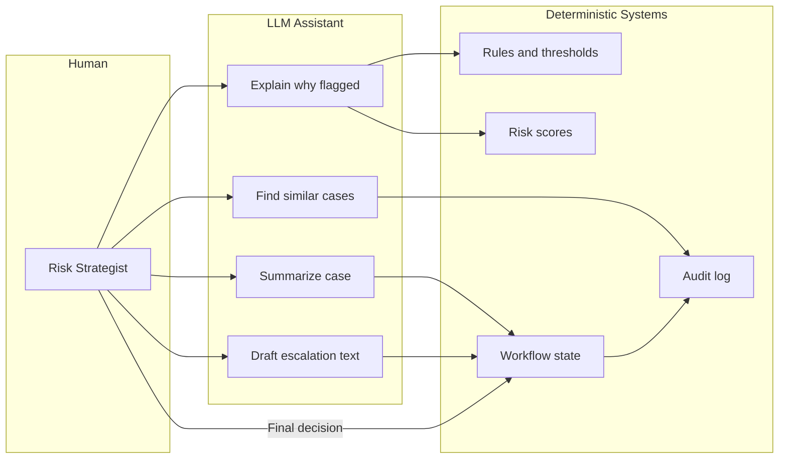
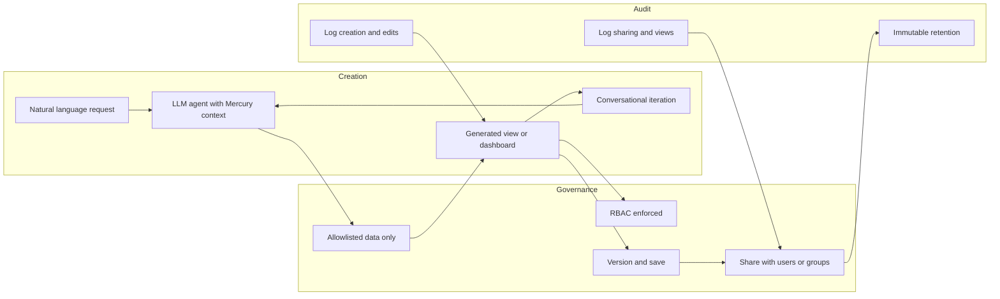

# Product Requirements Document: Mercury Internal Risk Operations Platform

**Document type:** Product Requirements Document (PRD)  
**Audience:** Internal product, design, and engineering review  
**Status:** Draft for review  
**Last updated:** February 2025  

---

## Summary

This PRD defines an **internal operations application** for Mercury used by **Risk Strategists** to combat financial crime (e.g., money laundering, fraud, human exploitation). The tool supports high-stakes decision-making during onboarding and ongoing account monitoring, balancing risk detection, operational efficiency, and customer impact. The product is **agentic by default** (LLM-powered) and includes **self-serve creation of custom tools and dashboards** by strategists, with clear boundaries between deterministic systems and AI, plus guardrails and auditability. For the **strategist control plane** evolution (system health as default, decision lineage, counter-argument LLM, Sandbox vs. Operational views), see [PRD v2](PRD-Risk-Operations-Platform-v2.md).

---

## 1. Context: Company and Product Research

The following context informs product scope and constraints. Mercury-specific details (exact rules, schemas, system names) are unknown; placeholders are used where product/engineering must fill in.

### 1.1 What Mercury Is

- **Business model:** B2B fintech; business banking and financial operations for startups and small businesses.
- **Scale:** 200K+ customers.
- **Product footprint:** Checking and savings, debit and credit cards, domestic and international wires (40+ currencies), ACH, invoicing, treasury management, accounting integrations (e.g., QuickBooks, Xero, NetSuite).

### 1.2 Operating Model

- Mercury is **not a bank**. Banking services are provided through **FDIC-insured partner banks** (Choice Financial Group, Column N.A., Patriot Bank N.A.; transition away from Evolve Bank & Trust in progress).
- Customers have **direct contractual relationships** with partner banks; Mercury builds product, compliance, and risk tooling.
- Partner banks are regulated (FDIC, FRB, OCC, state); Mercury provides policies, procedures, and reports to partners and regulators for examinations.

### 1.3 Where Financial Crime Risk Is Relevant

| Area | Relevance |
|------|-----------|
| **Onboarding** | USA PATRIOT Act / KYC: identity verification, beneficial ownership, entity formation, U.S. nexus. |
| **Ongoing activity** | Transaction monitoring (wires, ACH, card), sanctions screening, unusual pattern detection. |
| **Product controls** | ACH authorization and limits, MFA by default, SOC 2, PCI — all are risk-relevant touchpoints. |

### 1.4 Internal Capability

Mercury has in-house compliance and risk teams that work with fraud and security engineers, product managers, and bank partners to build products, tools, and alerts that flag suspicious activity. This PRD assumes Mercury owns detection logic and workflows; partner banks retain regulatory responsibility.

---

## 2. Context: Domain Research (Financial Crime and Risk Operations)

The product is designed to align with established patterns in financial crime operations while supporting Mercury’s multi-stakeholder, partner-bank model.

| Area | Industry pattern | Implication for this product |
|------|------------------|------------------------------|
| **AML value chain** | KYC risk assessment, sanctions screening, transaction monitoring, case management. Next-generation **case management** is central. | Unified platform spanning alerts, accounts, transactions, cases, and outcomes; case-centric workflows. |
| **Transaction monitoring** | Rule-based systems often produce 90–95% false positives; ML can reduce false positives (triage, suppression) but requires **explainability** and **human oversight**. Over-suppression can miss true positives. | Explainable rule hits and model contributions; human-in-the-loop for final decisions; no LLM-only actions on account status or SAR. |
| **Rule engines vs. ML** | Rules = transparent, auditable, policy-aligned. ML = better precision/triage. Typical pattern: rules generate alerts; ML/scores prioritize; humans decide. | Clear attribution: which rules fired, which signals drove scores; LLM explains, does not decide. |
| **Case management** | Alert → triage → case creation → investigation → decision (escalate, close, SAR, account action) → documentation and audit. Multi-stakeholder (ops, investigators, partner banks, regulators). | Workflow actions (assign, escalate, close, document) with structured rationale; support for partner bank and regulator handoffs. |
| **Auditability and regulation** | Full audit trails (who, what, when, why); regulator-ready model documentation; compliance-led design; human-in-the-loop for final suspicion/action decisions. | Immutable audit log; every prompt/response and generated view logged; deterministic systems own state. |
| **GenAI/LLM in compliance** | Used for automation, summarization, document handling, knowledge Q&A. Treated as **RegTech**: explainability, human oversight, tamper-evident audit trails. | LLM for explanation, summarization, search, drafting; guardrails and audit logging as specified in Sections 6 and 7. |

---

## 3. Problem Statement

Risk Strategists at Mercury must make **high-stakes decisions** (onboarding approvals, account actions, escalations to partner banks or regulators) in an environment where:

- **Unusual financial patterns** must be surfaced without overwhelming teams with false positives.
- **Decisions** have regulatory, customer trust, and velocity implications.
- **Human judgment** is applied selectively, informed by policy, thresholds, and system signals.
- **Internal tools** must support investigators, strategists, and coordination with external partners (banks, regulators).

Today, strategists likely operate across multiple systems and ad-hoc processes. The product should provide **quiet interruptions**, **clear decision points**, and systems that **scale trust** while **minimizing disruption** to legitimate customers—reflecting real-world financial crime operations, not a generic dashboard.

---

## 4. Target Users and Personas

### 4.1 Primary: Risk Strategists

- **Own and shape** high-stakes decision systems that can pause onboarding or account activity.
- Design tools for complex, multi-stakeholder ecosystems (investigators, operations, partner banks, regulators).
- Balance false positives vs. false negatives and understand the real cost of each.
- Develop fluency in: how Mercury detects unusual activity; how rules, thresholds, and policies are applied; when systems escalate to human review or automated action.

### 4.2 Secondary Personas

| Persona | Role | Needs from platform |
|---------|------|----------------------|
| **Investigators** | Case work, evidence gathering, disposition. | Case-level deep dives, similar-case search, narrative building, document rationale. |
| **Operations** | Throughput, SLAs, queue management. | Triage efficiency, workload visibility, clear assignment and escalation paths. |
| **Partner bank / Regulator** | Escalations, exams, oversight. | Sanitized or role-appropriate views; clear audit trail; documented rationale. |

### 4.3 Access Model

- **Internal Mercury:** Full access per RBAC (alerts, accounts, transactions, PII where authorized, workflow actions).
- **External partner:** Differentiated access (e.g., escalation packages, exam-ready views, no direct PII or write actions unless explicitly designed for partner use).

---

## 5. Key Use Cases and Workflows

### 5.1 Onboarding

- Review referred applications (e.g., KYC/risk holds).
- Understand **why** an application was flagged (rule hits, signals, risk score drivers).
- Decide: approve, deny, or escalate to partner bank or compliance.
- Document rationale for audit.

### 5.2 Ongoing Monitoring

- **Triage alerts:** Prioritize by risk, segment, or policy.
- **Drill into accounts/entities:** View transactions, behavior, risk signals, and contributing factors.
- **Similar past cases:** “What similar cases exist and how were they resolved?” to inform disposition.
- **Workflow actions:** Assign, escalate, close, request information.

### 5.3 Case Work

- Build investigation narrative from alerts, transactions, and internal signals.
- Document rationale (structured fields + free text where needed).
- Escalate to partner bank or file SAR; track outcomes.
- Support exam and regulatory review with clear audit trail.

### 5.4 Policy and Tuning

- Inspect **rule and threshold impact** (e.g., alert volume by rule, false-positive rates).
- **Compare cohorts** (e.g., by segment, outcome, time period).
- Support **policy changes** with evidence (e.g., “if we tighten threshold X, what’s the impact?”).

---

## 6. Functional Requirements

### 6.1 Unified Data and Views

- **Unified view** of: **alerts**, **accounts**, **transactions**, **risk signals/scores**, **rules and policies**, **case history and outcomes**.
- Ability to navigate from alert → account → transactions → cases and back.

### 6.2 Explainability

- **“Why was this account/alert flagged?”** — Narrative and structured breakdown: rule hits, model contributions (where applicable), key signals, with links to underlying evidence.

### 6.3 Similar-Case Search

- **“What similar cases exist and how were they resolved?”** — Search by behavior, segment, risk profile, or outcome; results with role-appropriate detail (anonymized or full per RBAC); support for disposition consistency and training.

### 6.4 Workflow Actions

- **Assign** (to self or others), **escalate** (to partner bank or internal team), **close** (with disposition code and rationale), **request info** (e.g., from customer or ops).
- **Document decision** with structured rationale (dropdowns/codes where possible, plus narrative).
- All actions auditable and tied to case/alert/account.

### 6.5 Self-Serve Tools and Dashboards

- Risk Strategists can **create, save, share, and iterate** on custom views and lightweight internal tools via natural language (and optional light configuration). See **Section 8** for full specification.

---

## 7. Non-Functional Requirements

### 7.1 Scale

- Support expected **alert and case volume** and **number of concurrent strategists** (TBD with Mercury ops).
- **Query latency** for triage and deep dives within acceptable bounds (e.g., sub-second for list views, few seconds for complex similar-case or cohort queries).

### 7.2 Reliability

- **Uptime** for ops-critical workflows (target TBD; e.g., 99.5%+ during business hours).
- **Graceful degradation** if LLM or optional features are unavailable: core triage, case view, and workflow actions must remain usable without the assistant.

### 7.3 Auditability

- **Immutable audit log** capturing: who viewed what PII; which actions were taken (and by whom, when); which prompts and responses were sent to/received from the LLM; which generated views were created, shared, and viewed.
- Logs retained for **regulatory retention period** (e.g., 5+ years where required).

### 7.4 Explainability

- **Deterministic systems** (rules, risk scores) have **explicit attribution** (e.g., rule ID, threshold, signal name).
- **LLM outputs** are clearly labeled (e.g., “AI-generated summary”) and are **not the sole basis** for final decisions on account status or SAR.

### 7.5 Security and Access

- **Role-based access control (RBAC):** PII only for authorized roles; same model for main app and generated views.
- **Optional partner-bank-safe views:** Sanitized or redacted views for handoffs and exams where full PII is not appropriate.

---

## 8. Success Metrics

| Category | Example metrics |
|----------|-----------------|
| **Operational** | Time-to-triage (e.g., median time from alert to first action); case closure rate; escalation rate; false-positive rate trend. |
| **Quality** | Consistency of dispositions on similar cases; audit/exam findings (target: no material findings attributable to tool misuse or missing audit). |
| **Efficiency** | Reduction in back-and-forth to answer “why was this flagged?”; adoption of self-serve views (e.g., % of strategists using at least one custom view per month). |

---

## 9. Risks and Tradeoffs

| Risk / tradeoff | Mitigation |
|-----------------|------------|
| **Customer friction vs. safety** (e.g., blocking vs. monitoring) | Policy-driven; tool supports both clear decision points and documentation so tradeoffs are explicit and auditable. |
| **Over-reliance on LLM** vs. deterministic logic | Clear boundaries: LLM explains and suggests; humans approve/deny/escalate/SAR; deterministic systems own scores, rules, and workflow state. |
| **Self-serve views misleading or used for decisions without guardrails** | Generated views are read-only, labeled “Strategist-created” and “Not a system of record”; allowlists and RBAC; optional compliance review for widely shared templates. See Section 8. |

---

## 10. Agentic and LLM-Enabled Experience

### 10.1 Design Principle

The product is **agentic by default**. A primary interface is an **LLM-powered assistant** with deep Mercury-internal context. Human judgment is **supported, not replaced**: deterministic systems and policy own final decisions; the LLM aids understanding and efficiency.

### 10.2 Prompt Context (What the LLM “Knows”)

- **Mercury internal systems:** Data schemas for accounts, transactions, alerts, cases, rules, outcomes (as available; placeholders where schemas are TBD).
- **Policies and workflows:** Rule logic, thresholds, escalation paths, partner bank handoffs (documented in a form the LLM can reason over).
- **Risk signals and scores:** How they are built and what they mean in plain language.
- **Historical decisions:** How similar cases were resolved, without exposing full PII in prompts where not needed (e.g., anonymized or aggregated).

### 10.3 Example Interactions

| User ask | Expected behavior |
|----------|--------------------|
| “Why was this account flagged?” | Narrative plus rule hits, top signals, and link to evidence (transactions, documents, etc.). |
| “What signals contributed most to this risk score?” | Ranked list with short explanations and attribution to source. |
| “What similar cases exist, and how were they resolved?” | Filtered, anonymized or role-appropriate summary with outcomes (e.g., closed, escalated, SAR). |
| “Summarize this case for partner bank escalation.” | Draft narrative from case facts and actions; human edits and signs off before send. |

### 10.4 Query and Reasoning Over

- **PII:** Only in accordance with role and need-to-know; all access logged.
- **Account behavior and transaction patterns:** Aggregates, timelines, segments—with clear data boundaries (e.g., no ad-hoc bulk export of full PII by default).
- **Internal risk signals, rules, and historical decisions:** With attribution to source systems so strategists can verify.

### 10.5 Clear Boundaries: LLM vs. Deterministic vs. Human

| Responsibility | Owner |
|----------------|-------|
| **Explanation, summarization, search, drafting, suggesting** | LLM |
| **Risk scores, rule firing, alert generation, workflow state, access control** | Deterministic systems |
| **Final approve/deny/escalate/SAR; overriding or accepting LLM-suggested text; signing off on escalations** | Human |

### 10.6 Guardrails, Permissions, and Audit

- **Guardrails:** No LLM-only final decisions on account status or SAR. Prompts and responses logged. PII redaction or scoping in logs where required by policy. Output labeled as “AI-generated” when used in case narrative.
- **Permissions:** Same RBAC as the rest of the tool (e.g., PII only for roles that already have it in the main app).
- **Audit logging:** Every prompt, response (or digest), user, timestamp, and any linked entity (alert, case, account) for exam and review.

---

## 11. End-User Tool and Dashboard Creation (Self-Serve, Agentic)

### 11.1 Goal

Risk Strategists can **self-serve custom dashboards and lightweight internal tools** without engineering dependency—in the spirit of “Cursor for risk ops”—using **natural language** (and optional light configuration) against Mercury’s internal data and context.

### 11.2 Capabilities

**Natural language (and optional config):**

- “Spin up a dashboard of high-risk onboarding referrals by segment and outcome.”
- “Show all accounts with international wires over $X in the last 30 days, grouped by business category and risk score.”
- “Add a filter for international wires over $X,” “Group by business category and risk score,” “Save this as a template for onboarding reviews.”

**Data scope:**

- Combine **accounts**, **transactions**, **alerts**, **rules**, **outcomes**, and other internal risk data (from allowlisted sources).
- The **LLM agent** has access to data schemas, relationships, risk signals/scores, policy/threshold definitions, and existing workflows so it can generate correct and safe queries.

**Generated artifacts:**

- **Web-based views:** Tables, filters, timelines, charts.
- **Case-level deep dives:** Single account or entity view.
- **Cohort/pattern analysis:** e.g., “accounts with X behavior in last 30 days.”
- **Templates:** Save and reuse for recurring investigations or monitoring.

**Iteration:**

- Conversational refinement: “Add a filter…”, “Group by…”, “Save as template…”.
- **Versioning:** Each significant change creates a new version; history visible and restorable.

### 11.3 How Generated Tools Differ From Productized Features

| Aspect | Strategist-created views | Productized features |
|--------|---------------------------|----------------------|
| **Lifecycle** | By default personal or team-scoped; not part of core product release. | Part of product roadmap; released and supported. |
| **Governance** | Can be promoted to “standard” only via defined process (e.g., compliance + product review). | Governed by product and engineering. |
| **Support** | Documented as “user-generated”; no SLA as core product; can be deprecated or restricted if policy changes. | Full support and SLA as applicable. |

### 11.4 Permissioning and Access (Especially PII)

- **Same RBAC** as main app: only roles that may access PII see PII in generated views.
- **Data boundaries:** Generated queries cannot exceed the viewer’s data access; no “export all PII” by default.
- **Sharing:** Share only with users/groups that have at least the same access level; sharing and access events logged.

### 11.5 Guardrails Against Unsafe or Non-Compliant Views

- **Allowlists:** Only pre-approved data sources and fields (especially PII) can be used in self-serve views; sensitive fields only if user role and purpose are allowed.
- **No write actions:** Generated views are **read-only** (no account actions, case closures, or SAR filing from within the view).
- **Labeling:** Clear “Strategist-created view” and “Not a system of record” so they are not mistaken for official reports.
- **Review:** Optional compliance review for templates before they are shared widely or used in exams.

### 11.6 Versioning, Sharing, and Auditability

- **Versioning:** Save points for each view/template; diff and rollback where applicable.
- **Sharing:** Explicit share with individuals or groups; list of viewers and editors; revocable.
- **Auditability:** Log creation, edits, shares, and views (who viewed which version when); retain for regulatory retention period; immutable.

---

## 12. Open Questions and Assumptions

| Item | Type | Notes |
|------|------|-------|
| Exact data schemas (accounts, transactions, alerts, cases, rules) | Unknown | PRD uses placeholder concepts; engineering to define with product. |
| Rule names, threshold definitions, risk score models | Unknown | Placeholder “Mercury internal risk signals” and “rules/thresholds” until Mercury specifics are provided. |
| Partner bank escalation APIs and data format | Unknown | Handoff and “partner bank escalation” are functional requirements; integration TBD. |
| Target alert/case volume and concurrent users | TBD | Non-functional scale targets to be set with ops. |
| Regulatory retention period for audit logs | Assumption | Often 5+ years for AML; confirm with compliance. |
| Promotion path for strategist-created views to “standard” | Assumption | Defined process (compliance + product review) to be documented in runbooks. |

---

## 13. Appendix A: Company Research Summary

- Mercury: B2B fintech, 200K+ customers, business banking and financial operations (checking, savings, cards, wires, ACH, invoicing, treasury, accounting integrations).
- Partner bank model: Choice Financial Group, Column N.A., Patriot Bank N.A. (Evolve transition in progress). Mercury is not a bank; customers contract with partner banks; Mercury builds product and risk tooling; partners are FDIC-insured and regulated (FDIC, FRB, OCC, state).
- Financial crime relevance: Onboarding (USA PATRIOT Act, KYC); ongoing (transaction monitoring, sanctions, pattern detection); product controls (ACH limits, MFA, SOC 2, PCI).
- Mercury states it has in-house compliance and risk teams working with fraud/security engineers, product, and bank partners to build tools and alerts that flag suspicious activity.

---

## 14. Appendix B: Domain Research Summary

- **AML value chain:** KYC risk assessment, sanctions screening, transaction monitoring, case management; case management is central in next-gen frameworks.
- **Transaction monitoring:** Rule-based systems often have 90–95% false positives; ML can reduce (e.g., triage) but needs explainability (e.g., SHAP, rule attribution) and human oversight; over-suppression can miss true positives.
- **Rule vs. ML:** Rules = transparent/auditable; ML = better precision; typical pattern: rules generate alerts, ML/scores triage, humans decide.
- **Case management:** Alert → triage → case → investigation → decision → documentation; multi-stakeholder; full audit trail.
- **GenAI/LLM in compliance:** Automation, summarization, Q&A; treated as RegTech with explainability, human oversight, and tamper-evident audit trails.

---

## 15. Appendix C: User Flow Diagrams

### 15.1 High-Level Decision Flow: Strategist, LLM, and Deterministic Systems

### 15.2 Self-Serve View Creation Flow

---

*End of PRD.*
