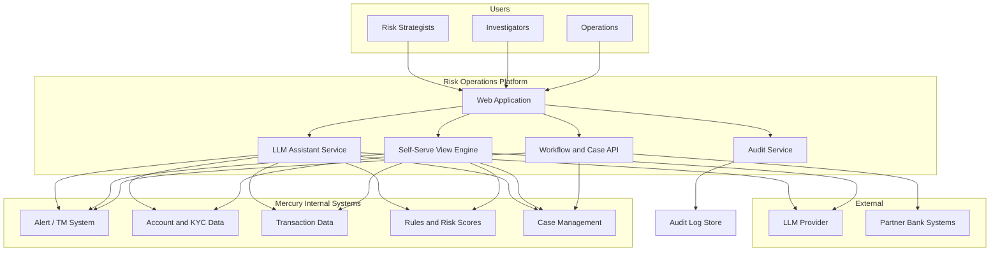

# Technical Design: Mercury Internal Risk Operations Platform

**Document type:** Technical Design  
**Audience:** Engineering, security, and compliance review  
**Status:** Draft for review  
**Last updated:** February 2025  
**Related:** [PRD-Risk-Operations-Platform.md](PRD-Risk-Operations-Platform.md), [PRD-Risk-Operations-Platform-v3.md](PRD-Risk-Operations-Platform-v3.md) (v3 additions)

---

## 1. Purpose and Scope

This document describes the **technical architecture** for the internal Risk Operations Platform described in the PRD. It covers system boundaries, data flow, LLM integration, auth/audit, self-serve view generation, and key technical decisions. Mercury-specific system names and schemas are left as placeholders where not yet defined.

---

## 2. High-Level Architecture

### 2.1 System Context

The platform sits between **Mercury internal risk and product systems** (alerts, accounts, transactions, rules, cases) and **Risk Strategists** (and secondary personas). It does **not** replace existing detection or rule engines; it aggregates, explains, and orchestrates workflows around them.

### 2.2 Logical Layers

| Layer | Responsibility | Key components |
|-------|----------------|----------------|
| **Presentation** | UI for triage, case deep dives, assistant chat, self-serve views | Web app (SPA or server-rendered) |
| **Orchestration / API** | Session, auth, routing, workflow actions, view CRUD | API gateway / BFF, Workflow and Case API |
| **Assistant** | LLM prompt assembly, tool use, response shaping, PII scoping | LLM Assistant Service |
| **View generation** | NL → query/spec, execution against allowlisted data, versioning | Self-Serve View Engine |
| **Data access** | Read from risk systems; write only to case/workflow and audit | Connectors / adapters to Mercury internal systems |
| **Audit** | Immutable log of actions, views, and LLM usage | Audit Service + Audit Log Store |

### 2.3 Principles

- **Deterministic systems own state:** Risk scores, rule firing, alert generation, and workflow state live in existing or dedicated Mercury systems; the platform reads and triggers actions via APIs, never as the sole source of truth for decisions.
- **Graceful degradation:** Core triage, case view, and workflow actions work without the LLM; assistant and self-serve views can be disabled or degraded independently.
- **Audit by design:** Every sensitive read, workflow action, and LLM interaction is logged before response; no “audit as afterthought.”

---

## 3. Data Flow

### 3.1 Data Sources (Mercury Internal)

| Source | Purpose | Access pattern |
|--------|---------|----------------|
| **Alerts** | Transaction monitoring / onboarding referrals | List, filter, get by ID; link to account and case |
| **Accounts** | Entity and KYC context | Get by ID; optional PII per RBAC |
| **Transactions** | Evidence for alerts and cases | Query by account/time; aggregated or paginated |
| **Rules / risk scores** | Explainability (why flagged) | Rule hits and score drivers per alert/account |
| **Cases** | Investigation and disposition | CRUD for case metadata, narrative, actions; link alerts/accounts |

Exact APIs and schemas are TBD; the platform assumes **read** from alerts, accounts, transactions, rules; **read/write** for case and workflow state (or delegation to existing case system).

### 3.2 Aggregation and Identity

- **Unified entity keys:** Alerts, accounts, and cases share stable IDs; the platform uses them to join data (e.g., alert → account → transactions → cases) without storing a full copy of source data. Prefer **query-time aggregation** or a thin **risk-ops read model** (materialized or virtual) rather than full ETL into the platform.
- **PII handling:** PII is fetched only when needed for the current user’s role and use case. No bulk export of raw PII by default; exports (if allowed) are logged and rate-limited.

### 3.3 Data Flow for “Why was this flagged?”

1. User asks about an alert or account (e.g., from case or triage list).
2. Platform resolves **alert ID** and **account ID**; checks **RBAC** for that entity.
3. **Deterministic path:** Fetch rule hits and risk-score drivers from Rules/scores system; fetch alert and account metadata from Alerts/Accounts.
4. **Assistant path:** Assistant service receives structured context (rule names, signal names, thresholds, no raw PII unless role allows); calls LLM with “explain why this was flagged” prompt; returns narrative + links to evidence.
5. **Audit:** Log prompt digest, response digest, user, alert/account ID, timestamp.

---

## 4. LLM Integration

### 4.1 Role of the LLM

- **Explanation:** “Why was this account/alert flagged?” — LLM turns structured rule/signal data into narrative; it does not compute scores or rule hits.
- **Summarization:** Case summaries, escalation drafts; human edits and signs off.
- **Similar-case search:** LLM helps translate natural language to structured filters (e.g., segment, outcome, date range); actual search runs against case/outcome store with RBAC.
- **Self-serve views:** LLM translates “show me X” into a view spec or query against allowlisted schema; execution is deterministic (see Section 6).

### 4.2 Context Assembly

- **Static context (in prompt or RAG):** Data schemas (allowlisted), policy summaries (rule categories, escalation paths), glossary of risk signals. Updated when schemas or policy docs change; versioned.
- **Dynamic context (per request):** User identity and role; current alert/case/account IDs; structured facts (rule hits, score drivers, case timeline) fetched by the platform and injected into the prompt. PII included only if user has PII access and request is scoped to that entity.
- **Scope:** Prefer **bounded context per request** (e.g., one alert + one account + related case) to avoid token bloat and accidental PII leakage. For similar-case search, send anonymized or aggregated patterns, not full case text.

### 4.3 Tool Use vs. Free-Form Generation

- **Structured actions (assign, escalate, close, request info):** Implemented as **deterministic workflow API calls**, not LLM tool calls that perform state changes. The LLM may suggest “escalate to partner bank” and draft text; the user clicks a button to execute; the button calls the Workflow API. This keeps “who did what” unambiguous in audit.
- **Read-only tools (optional):** LLM can be given tools that **only read** (e.g., “get_rule_hits(alert_id)”) so it can pull in context; all such calls are logged and rate-limited.

### 4.4 Guardrails

- **No write tools for account/case/SAR:** LLM cannot call APIs that change case state, account status, or SAR filing.
- **Output labeling:** Any LLM-generated text used in case narrative or escalation is stored with a flag (e.g., `ai_generated: true`); UI shows “AI-generated” where applicable.
- **PII in logs:** Prompts and responses sent to the audit log are redacted or hashed for PII (or only digest + entity IDs stored); full text only in secure, access-controlled storage if required for dispute resolution.
- **Model and version:** Audit log records model name and version for each LLM request for reproducibility and regulatory review.

### 4.5 Failure and Degradation

- **LLM timeout or error:** Return a clear message; offer structured explainability (rule hits, signals) without narrative. Core triage and case views remain available.
- **Rate limits / quota:** Queue or return “try again” so that one tenant cannot starve others; consider per-user or per-role limits for cost and fairness.

---

## 5. Authentication, Authorization, and Audit

### 5.1 Authentication

- **Internal Mercury users:** Integrate with existing identity provider (e.g., SSO/SAML or OIDC). Session or token issued after auth; passed to all backend services.
- **Partner bank / external:** If the platform ever exposes UI or API to partners, use separate auth (e.g., API keys or partner-specific SSO) and strictly scoped roles (e.g., view escalation package only).

### 5.2 Authorization (RBAC)

- **Roles (example):** Risk Strategist, Investigator, Operations, Compliance, Partner Bank Viewer. Exact roles to be defined with product and security.
- **Permissions:** Map roles to (resource, action), e.g., (alerts, read), (cases, read|write), (PII, read), (workflow, escalate), (views, create|share). Same permission model for **main app** and **self-serve generated views**: if a user cannot see PII in the main app, generated views must not expose PII to them.
- **Enforcement:** API layer and View Engine enforce RBAC before returning data. Data sources (e.g., Mercury internal APIs) may enforce their own; platform must still enforce at the boundary so that a compromised view spec cannot bypass restrictions.

### 5.3 Audit Logging

- **What to log:** (1) **Data access:** who viewed which alert/case/account (and whether PII was included); (2) **Workflow actions:** who performed assign/escalate/close/request info, with entity IDs and disposition codes; (3) **LLM usage:** user, timestamp, prompt digest (or hash), response digest, model, entity IDs linked to the request; (4) **Self-serve views:** creation, edit, share, and view events (who viewed which view/version when).
- **Format:** Structured (e.g., JSON) with required fields: `event_type`, `actor_id`, `timestamp`, `resource_type`, `resource_id`, `details`. Append-only; no updates or deletes.
- **Storage:** Dedicated **Audit Log Store** (e.g., append-only table or object store with WORM). Retention per compliance (e.g., 5+ years); access restricted to compliance and security.
- **Tamper evidence:** Optional: hash chain or periodic signing of log segments so that later alteration is detectable.

---

## 6. Self-Serve View and Dashboard Generation

### 6.1 Flow

1. **User input:** Natural language (e.g., “high-risk onboarding referrals by segment and outcome”) and optional filters/date range.
2. **Schema and allowlist:** The View Engine has a **registered schema** of allowlisted sources and fields (e.g., `alerts`, `accounts`, `outcomes` with specific columns). PII fields are tagged; inclusion in a view depends on creator’s and viewer’s RBAC.
3. **Spec generation:** LLM (with schema and policy context) produces a **view spec** (e.g., JSON or internal DSL) describing: data source(s), filters, groupings, columns, chart type. No raw SQL or arbitrary code from the LLM; execution is via a **safe interpreter** that only runs against allowlisted tables/views and respects RBAC.
4. **Execution:** Backend runs the spec against the risk-ops read model or approved APIs; results are paginated and returned to the UI. Query is logged (spec + user + timestamp).
5. **Iteration:** User says “add filter for international wires over $X”; same flow produces an updated spec; diff is stored as new version.
6. **Save and share:** Spec is saved as a named view or template; sharing is explicit (user/group list); each save creates a version. View and share events are audited.

### 6.2 Allowlisted Data and Safety

- **Allowlist:** Only pre-approved entities (e.g., `alerts`, `cases`, `accounts`, `outcomes`) and columns (e.g., `alert_id`, `risk_tier`, `outcome_code`; PII columns listed separately). LLM output is validated against this schema; unknown columns or sources are rejected.
- **Read-only:** Generated views never issue write or workflow actions; they only query data.
- **RBAC at execution time:** The executed query is constrained by the **viewer’s** permissions (and, for shared views, by the creator’s). If the viewer cannot access PII, the view definition cannot reference PII columns for that viewer’s render.

### 6.3 Versioning and Sharing

- **Versioning:** Each “save” creates a new version (spec + timestamp + author). History is visible; restore/diff supported where feasible.
- **Sharing:** View has a list of viewers and (optional) editors. Share only with users/groups that have at least the same data access as the view’s scope; sharing and access are logged.
- **Labeling:** UI clearly shows “Strategist-created view” and “Not a system of record” so it is not used as the sole basis for regulatory reporting without compliance review.

---

## 7. Key Technical Decisions and Tradeoffs

| Decision | Options | Choice | Rationale |
|----------|---------|--------|-----------|
| **LLM state changes** | LLM can call workflow APIs vs. LLM only suggests, user confirms | **User confirms** | Audit clarity; no ambiguity on “who decided”; aligns with PRD. |
| **PII in LLM context** | Full PII in prompt vs. minimal/redacted | **Minimal/redacted by default** | Reduce leakage in logs and to provider; include only when role and request need it. |
| **View execution** | Raw SQL from LLM vs. spec/DSL interpreted by platform | **Spec/DSL + safe interpreter** | Avoid injection and arbitrary access; allowlist enforcement in one place. |
| **Audit log storage** | Same DB as app vs. dedicated append-only store | **Dedicated store** | Retention and access control independent of app DB; easier WORM and compliance. |
| **Aggregation layer** | Real-time only vs. read model / cache | **TBD (real-time first; read model if scale demands)** | Start with direct reads; introduce read model if latency or load requires. |
| **Assistant availability** | Required vs. optional | **Optional (graceful degradation)** | Core workflows must work without LLM; PRD requires degradation. |

---

## 8. Deployment and Operations (Outline)

- **Environments:** At least staging and production; production used only for real risk data.
- **Secrets:** API keys for Mercury internal systems and LLM provider in secret manager; no secrets in client or in view specs.
- **Monitoring:** Latency and error rate for API, Assistant, and View Engine; alert on audit log write failures; dashboards for ops (no PII).
- **Incident response:** Runbook for “LLM down” (degrade to structured-only explainability); runbook for audit log backlog or failure (prioritize log durability).

---

## 9. Open Technical Questions

| Item | Owner | Notes |
|------|-------|-------|
| Mercury internal API contracts (alerts, accounts, transactions, rules, cases) | Engineering + product | Needed for connectors and schema allowlist. |
| Identity provider and role model | Security + product | SSO integration and RBAC mapping. |
| LLM provider and model choice | Engineering + compliance | Cost, latency, data residency, and audit requirements. |
| Audit log retention and WORM policy | Compliance | Confirm retention period and tamper evidence. |
| Read model vs. direct reads and caching | Engineering | After load and latency targets are known. |

---

## 10. Appendix A: v3 Additions (PRD v3)

The following technical notes support [PRD v3](PRD-Risk-Operations-Platform-v3.md) (signal explainability, case pattern discovery, scenario simulation). The rest of this Technical Design remains unchanged.

### 10.1 Data for Feature-Level Explainability (Pillar 1)

- **Dependency:** The platform must obtain **feature-level contributions** per rule hit (and, where applicable, per risk score). This typically requires the rule or risk-score system to expose a structured payload, e.g.:
  - Rule output: rule ID, threshold values used, and a list of (feature name, value, threshold or tier) that contributed to the fire.
  - Risk-score API: score value plus contribution breakdown (e.g. SHAP-style or rule-based attribution).
- **Platform role:** Consume that payload from Mercury internal systems; render it in the UI with links to evidence (transactions, account attributes, rule definition). No computation of contributions in the platform; exposure only. If the upstream system does not yet expose breakdowns, Pillar 1 scope may be limited to rule names and thresholds until contracts are extended.

### 10.2 Case Patterns Data Model (Pillar 2)

- **Archetype taxonomy:** Define a set of behavior archetypes (e.g. rule-based labels, segment + outcome combinations, or disposition-derived clusters). Taxonomy is TBD with product and compliance; the platform assumes a **grouping key** per case (e.g. `archetype_id` or composite of rule + segment).
- **Grouping keys:** Cases are grouped by archetype; aggregation stores (or query-time logic) support: count per archetype, resolution mix (closed no action, escalated, SAR, etc.), and optional trend by time or segment. Same RBAC as case list: user sees only cases they are allowed to see; pattern-level aggregates respect the same visibility.
- **Navigation:** Pattern view queries by grouping key; drill-down to case list is a filtered case list (same API and audit as existing Cases). “See pattern” from a case resolves the case’s archetype and links to the pattern view.

### 10.3 Simulation Execution and Audit (Pillar 3)

- **Execution:** Scenario simulation is **read-only**. Recommended approach: run a batch (or replay) over **historical** alerts for a defined window (e.g. last 90 days) with **hypothetical** rule parameters (e.g. new threshold). Compare resulting alert set to actuals to derive projected impact (e.g. alert volume delta, proxy false-positive rate delta, and—if defined—estimated “missed” alerts). No write to rule config or production systems from the simulation path.
- **Impact metrics:** Implementation depends on availability of historical alert and outcome data. Projected change in alert volume and close-as-no-action rate can be computed from replay; “missed” high-risk events may require a defined heuristic (e.g. transactions that would have been alertable under current rule but not under proposed threshold) and must document assumptions and limitations.
- **Audit:** Every simulation run is logged: `event_type` (e.g. `simulation_run`), `actor_id`, `timestamp`, `resource_type` (rule or rule group), `resource_id`, `details` (scenario parameters and result digest: e.g. alert volume delta, FP proxy delta). Stored in the same Audit Log Store as other events; retention and access follow existing audit policy. No automatic application of rule changes; applying a change remains a separate, audited workflow (e.g. change request or policy release).

---

*End of Technical Design.*
